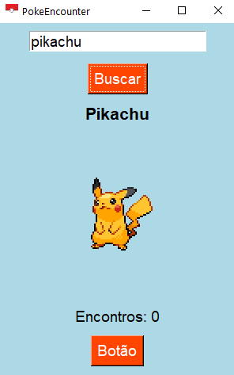

# 🧿 PokeEncounter

Um aplicativo simples feito em Python com Tkinter que permite buscar Pokémon pela [PokéAPI](https://pokeapi.co), exibir sua versão *shiny* e contar o número de encontros — ideal pra quem faz *shiny hunting*! ✨

## 🎮 Funcionalidades

- Busca Pokémon pelo nome
- Exibe sprite *shiny* em tamanho dobrado
- Mostra nome capitalizado do Pokémon
- Botão para contar encontros (ideal para caçadas)
- Interface leve com visual retrô minimalista

## 📸 Preview



## 📦 Instalação

1. Clone o repositório:
``` bash
git clone https://github.com/Srleo12/API_encounter.git
cd pokeencounter
```

2. Instale as dependências (recomendo usar um ambiente virtual):
```bash
pip install pillow requests
```

3. Rode o projeto:
```bash
python PokeEncounter.py
```
## 🧰 Dependências

- <b>Tkinter</b> (já vem com o Python)
- <b>Requests</b>
- <b>Pillow</b>


## 💡 Como usar

1. Digite o nome do Pokémon em inglês (ex: <b>bulbasaur</b>, <b>pikachu</b>, <b>gengar</b>)
2. Clique em "Buscar"
3. O sprite shiny aparecerá
4. Clique no botão “Botão” (pode renomear depois pra “Encontrei!” ou “+1”) para contar os encontros
5. Para mais dúvidas de como usar use o arquivo em txt [<b>"como_usar.txt"</b>](https://vscode.dev/github/Srleo12/API_encounter/blob/main/como_usar.txt)

## 🖼️ Ícones e Imagens
- <b>Você pode adicionar o arquivo icone.ico na mesma pasta para personalizar o ícone da janela.</b>

## 📋 TODOs futuros
- <b>Suporte a sprites normais vs shiny</b>
- <b>Adicionar som de encontro</b>
- <b>Salvar progresso dos encontros</b>
- <b>Tema escuro</b>